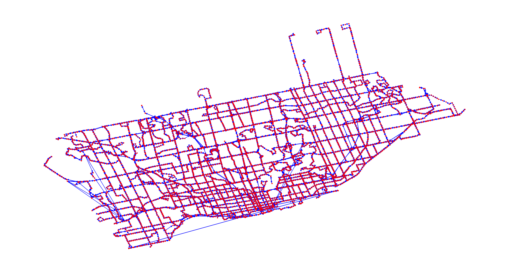

# mapping
Finds the optimal meetup location for a pedestrian and driver that have differing starting locations but the same target location. By constructing a _networkx_ graph using Toronto Transit Commission (TTC) data, we only call the Google Maps API only once per use. 

### Idea
Imagine Jack and Jill have plans to go to Bill's house. Jack has a vehicle and Jill does not. Jack and Jill agree that Jill will take the TTC to a place where it is convenient for Jack to pick Jill up. **What is the optimal pickup location**? 

What if Jack is willing to go out of his way in order to save Jill time? What if we decide Jill's time is twice as valuable as Jack's time, or vice versa? What if Jill is willing to walk a certain distance? How many times is Jill wishing to get off one bus (or subway or streetcar) and get onto another? We'd like to find the optimal meetup location given these (and possibly other) parameters. 

### Tasks
 - [x] Get google maps API key
 - [x] Download TTC route information
 - [x] Create graph of TTC routes
 - [x] Create basic TTC navigation algorithm that tells users how to get from point A to point B
 - [x] Create optimal meetup location finder that assumes Jack will not go more than one minute out of his way

### Notes
 - These algorithms will only work within range of the TTC

### Getting Started
Visit [this](https://developers.google.com/maps/documentation/embed/get-api-key) link to get your own API key. 
```
git clone https://github.com/danitamm/mapping.git
cd mapping
source setup.sh
python main.py
```
The _setup.sh_ script downloads the data, creates a virtual environment, and stores your API key. If you have issues with your API key, you can enter it manually input _keys.py_.

### Next Steps
 - write brief guide to securing and storing a Google Maps API key
 - add logic that covers the questions in the second paragraph of the **Idea** section.

### Figures

*A graph of all TTC routes and stops. Generated using networkx.*
